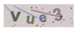

# vue3-captcha-canvas

### for vue3 use


## install
```
yarn add vue3-captcha-canvas
```

### usage
```
<script setup>
import { CaptchaImage } from "vue3-captcha-canvas";

const captchaRef = ref();

const verify = () => {
    captchaRef.value.verify("1234")
}
</script>

<template>
    <CaptchaImage ref="captchaRef"/>
</template>
```

### props
| Name               | Type     | Default         | Desp                                                  |
|--------------------|----------|-----------------|-------------------------------------------------------|
| codeLength         | Number   | 4               | length of verification code                           |
| codeType           | String[] | ["A", "a", "0"] | type of verification code A [A-Z] / a [a-z] / 0 [0-9] |
| contentWidth       | Number   | 120             | captcha width                                         |
| contentHeight      | Number   | 40              | captcha height                                        |
| fontSizeMin        | Number   | 24              | minimum font size                                     |
| fontSizeMax        | Number   | 36              | maximum font size                                     |
| textColorMin       | Number   | 50              | minimum text color                                    |
| textColorMax       | Number   | 160             | maximum text color                                    |
| textDegMin         | Number   | -30             | minimum text rotation                                 |
| textDegMax         | Number   | 30              | maximum text rotation                                 |
| backgroundColorMin | Number   | 200             | minimum background color                              |
| backgroundColorMax | Number   | 220             | maximum background color                              |
| dotCount           | Number   | 30              | interference dot count                                |
| dotColorMin        | Number   | 0               | minimum dot color                                     |
| dotColorMax        | Number   | 255             | maximum dot color                                     |
| lineCount          | Number   | 4               | interference line count                               |
| lineColorMin       | Number   | 40              | minimum line color                                    |
| lineColorMax       | Number   | 180             | maximum line color                                    |
